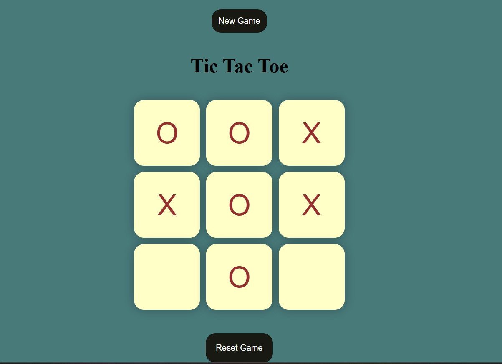

## ❌⭕ Tic-Tac-Toe  

A classic **Tic-Tac-Toe** game built using HTML, CSS, and JavaScript. Play against the computer and enjoy this timeless game!  

## 🚀 Features  
- ✅ Play in **two-player mode**  
- ✅ Simple and interactive UI  
- ✅ Displays the winner or detects a draw  
- ✅ Responsive design for smooth gameplay on all devices  

## 🛠 Tech Stack  
HTML, CSS, JavaScript  

## 📷 Screenshots  
  

## 📌 How to Play  
1. The game board consists of a **3x3 grid**.  
2. Player 1 (X) and Player 2 (O) take turns marking a square.  
3. The first player to align **three marks in a row, column, or diagonal** wins.  
4. If all squares are filled without a winner, the game ends in a **draw**.  

## 📥 Download & Installation  
Clone the repository using Git:  
```bash
git clone https://github.com/aklema094/Tic-Tac-Toe.git
```  
Or download the ZIP file manually from [here](https://github.com/aklema094/Tic-Tac-Toe/archive/refs/heads/main.zip).  
